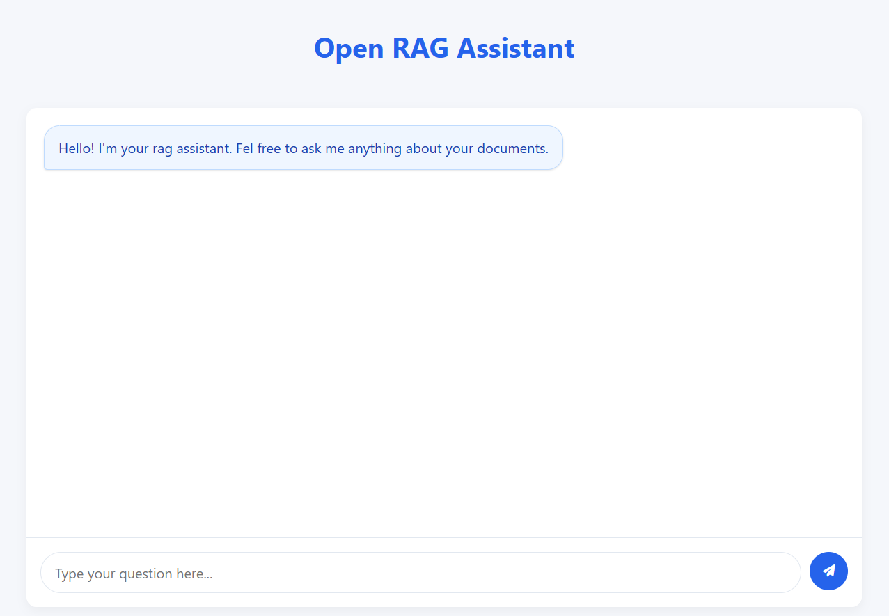

# Document RAG Chatbot


A Retrieval-Augmented Generation (RAG) chatbot that answers questions based on your documents. This project integrates LlamaIndex and LangChain with Ollama to provide accurate, context-aware responses to queries about your document collection.

## Features

- **Document Processing**: Automatically parses PDF, Word, and Excel documents
- **Vector Search**: Uses Chroma DB for efficient semantic search
- **Context-Aware Responses**: Generates answers based on relevant document sections
- **Modern Web Interface**: Clean, responsive UI for interacting with your documents
- **Cross-Platform**: Works on Windows, macOS, and Linux

## Project Structure

```
rag-chatbot/
├── backend/
│   ├── src/
│   │   └── main.py
│   ├── data/
│   │   └── (your documents)
│   └── chroma_db/
│       └── (vector database)
├── frontend/
│   ├── index.html
│   ├── styles.css
│   ├── app.js
│   ├── components/
│   │   ├── ChatWindow.js
│   │   ├── MessageList.js
│   │   └── MessageInput.js
│   └── package.json
└── README.md
```

## Prerequisites

- Python 3.11
- Node.js and npm
- Ollama (running locally)
- LlamaParse API key

## Installation

### Backend Setup

1. Clone the repository:
   ```bash
   git clone https://github.com/yourusername/rag-chatbot.git
   cd rag-chatbot
   ```

2. Create and activate a virtual environment:
   ```bash
   python -m venv venv
   # On Windows
   venv\Scripts\activate
   # On macOS/Linux
   source venv/bin/activate
   ```

3. Install the required Python packages:
   ```bash
   pip install flask flask-cors llama-parse langchain langchain-chroma langchain-ollama llama-index
   ```

4. Set up your LlamaParse API key:
   ```bash
   # On Windows
   set LLAMA_CLOUD_API_KEY=your_api_key_here
   # On macOS/Linux
   export LLAMA_CLOUD_API_KEY=your_api_key_here
   ```

5. Add your documents to the `backend/data` directory

### Frontend Setup

1. Navigate to the frontend directory:
   ```bash
   cd frontend
   ```

2. Install dependencies:
   ```bash
   npm install
   ```

## Usage

1. Start the backend server:
   ```bash
   cd backend/src
   python main.py
   ```

2. Start the frontend development server:
   ```bash
   cd frontend
   npm start
   ```

3. Open your browser and go to `http://localhost:3000` (or the URL shown in your terminal)

4. Start asking questions about your documents!

## How It Works

1. **Document Processing**: 
   - Documents are loaded from the data directory
   - LlamaParse extracts text and structure from various file formats
   - Documents are split into manageable chunks

2. **Indexing**: 
   - Text chunks are converted to vector embeddings
   - Embeddings are stored in Chroma DB for efficient retrieval

3. **Query Processing**:
   - User questions are processed by the frontend
   - The backend retrieves relevant document chunks
   - Ollama generates an answer based on the retrieved context

## API Reference

### `/chat` Endpoint

**Request:**
- Method: POST
- Content-Type: application/json
- Body: `{ "question": "Your question here" }`

**Response:**
```json
{
  "status": "success",
  "question": "Your question here",
  "answer": "The answer generated from your documents"
}
```

## Environment Variables

- `LLAMA_CLOUD_API_KEY`: Your LlamaParse API key for document processing

## Customization

### Changing the Model

To use a different Ollama model, modify the `model_name` parameter in the `RAGPipeline` initialization in `main.py`:

```python
pipeline = RAGPipeline(model_name="llama3.1:8b")
```

### Modifying Document Processing

To adjust how documents are processed, modify the `text_splitter` parameters in the `RAGPipeline` class:

```python
self.text_splitter = RecursiveCharacterTextSplitter(
    chunk_size=1500,  # Smaller values for more precise retrieval
    chunk_overlap=200,  # Larger values for better context preservation
    length_function=len
)
```

## Troubleshooting

- **Issue**: Backend can't find documents
  - **Solution**: Ensure your documents are in the `backend/data` directory

- **Issue**: "API key not found" error
  - **Solution**: Make sure the `LLAMA_CLOUD_API_KEY` environment variable is set

- **Issue**: Frontend can't connect to backend
  - **Solution**: Check that the backend is running and CORS is properly enabled

## License

[MIT License](LICENSE)

## Acknowledgments

- [LlamaIndex](https://www.llamaindex.ai/) - Document indexing framework
- [LangChain](https://langchain.com/) - LLM application framework
- [Ollama](https://ollama.ai/) - Local language model runtime
- [LlamaParse](https://www.llamaindex.ai/) - Document parsing service